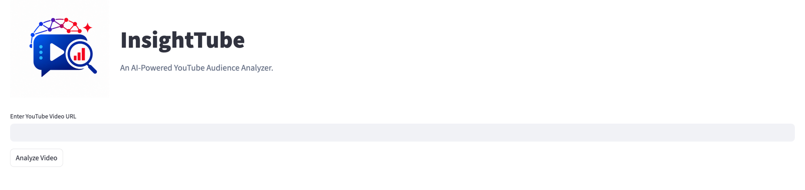
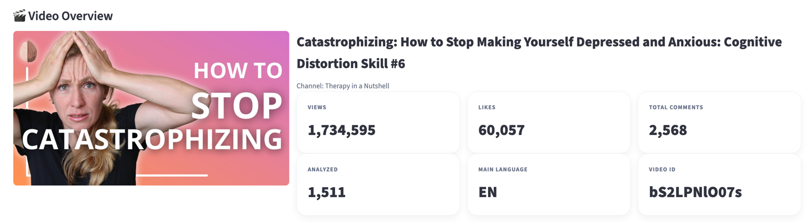
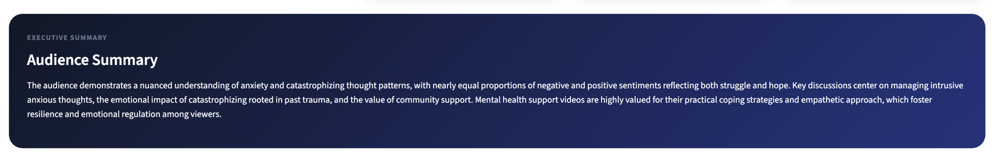
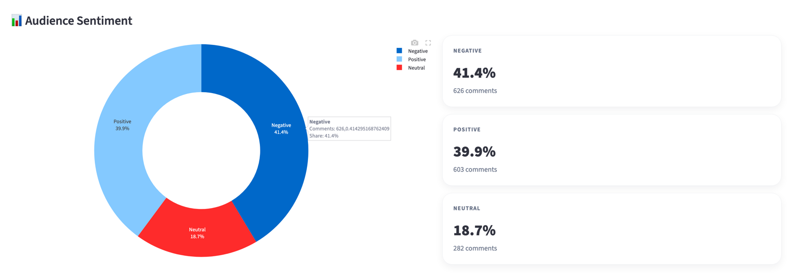
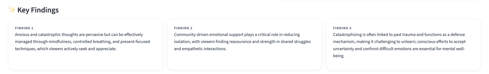
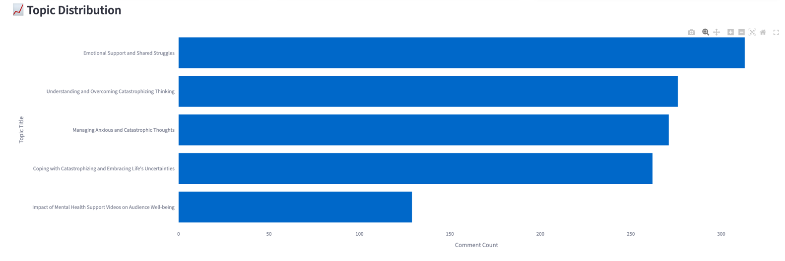
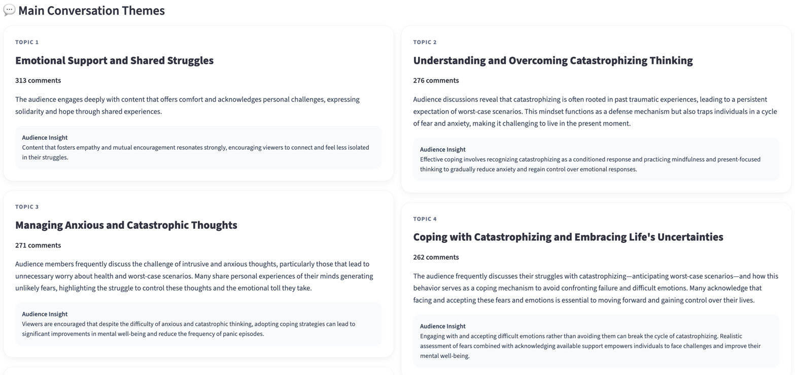

# InsightTube: An AI-Powered YouTube Audience Analyzer

<p align="center">
  
</p>

<p align="center">
  <b>An AI-powered, browser-based YouTube audience analysis system that transforms comments into sentiment results, topic groups, and actionable audience insights.</b>
</p>

---

## Project Overview

InsightTube is an AI-powered audience intelligence system developed to analyze YouTube comments automatically. The system allows users to enter a YouTube video URL, collects public comments and video metadata, processes the text data, applies sentiment analysis and topic discovery, and presents the results through an interactive Streamlit dashboard.

Unlike traditional static dataset analysis projects, InsightTube works dynamically. Each analysis is generated based on the selected YouTube video, the available comments, and the audience discussions under that video.

The main purpose of this project is to transform unstructured YouTube comments into meaningful and interpretable audience insights.

---

## Problem and Motivation

YouTube comments contain valuable information about audience opinions, reactions, expectations, and discussion patterns. However, manually analyzing large volumes of comments is difficult, time-consuming, and inefficient.

Basic engagement metrics such as views, likes, and comment counts do not fully explain how the audience feels or what they are discussing. In addition, YouTube comments may include different languages, emojis, slang, informal expressions, very short texts, and mixed opinions.

InsightTube addresses this problem by combining natural language processing, multilingual sentiment analysis, topic discovery, AI-supported interpretation, and dashboard visualization in a single system.

---

## Aim and Scope

The aim of this project is to develop an AI-powered YouTube audience analyzer that automatically processes comments from a selected YouTube video and helps users understand audience sentiment, main discussion topics, and key audience insights.

The scope of the system includes:

* Collecting public YouTube comments from a video URL
* Collecting video metadata such as title, channel name, views, likes, and comment count
* Cleaning and preprocessing raw comment text
* Detecting comment languages
* Classifying comments as positive, negative, or neutral
* Discovering main discussion topics
* Generating AI-supported summaries and key findings
* Presenting results through an interactive dashboard

---

## Main Features

* Dynamic YouTube video URL-based analysis
* Automatic video metadata and comment collection
* Support for top-level comments and replies
* Text preprocessing and cleaning
* Language detection and filtering
* Transformer-based multilingual sentiment analysis
* Semantic topic discovery from audience discussions
* AI-generated audience summaries and key findings
* Interactive dashboard built with Streamlit
* Visual outputs for sentiment distribution and topic distribution
* Video overview cards for key video statistics

---

## System Workflow

The system follows an end-to-end NLP pipeline:

```text
YouTube URL Input
        ↓
Video ID Extraction
        ↓
Comment and Metadata Collection
        ↓
Text Preprocessing
        ↓
Language Detection
        ↓
Sentiment Analysis
        ↓
Topic Discovery
        ↓
AI-Generated Insights
        ↓
Dashboard Visualization
```

---

## Methodology

InsightTube was developed as a dynamic, browser-based NLP system. The process starts when the user enters a YouTube video URL into the dashboard. The system extracts the video ID from the URL and uses YouTube Data API v3 to collect video metadata and public comments.

After data collection, the comments are processed through several preprocessing steps. These steps include text cleaning, normalization, duplicate handling, filtering unsuitable comments, and language detection. This stage is important because YouTube comments often contain noisy and informal text such as emojis, slang, very short expressions, repeated comments, and mixed-language structures.

For sentiment analysis, the system uses a transformer-based multilingual NLP model. XLM-RoBERTa is used to classify comments into positive, negative, and neutral categories. This model was selected because YouTube comments can include different languages and context-dependent expressions.

In addition to sentiment analysis, InsightTube applies semantic topic discovery. Sentence embeddings are used to represent comments semantically, and similar comments are grouped to identify the main discussion themes in the comment section.

Finally, the system generates AI-supported audience summaries and key findings. These outputs help users interpret the analysis results more easily. All results are presented through an interactive Streamlit dashboard with visual outputs such as sentiment distribution, topic distribution, video overview, audience summary, key findings, and main conversation themes.

---

## Dashboard Preview

### User Interface



The user interface allows users to enter a YouTube video URL and start the analysis process through a browser-based dashboard.

---

### Video Overview



The video overview section displays key video information such as the video title, channel name, video ID, view count, like count, total comment count, analyzed comment count, and thumbnail.

---

### Audience Summary



The audience summary section provides an AI-generated interpretation of the general audience reaction based on the analyzed comments.

---


### Audience Sentiment



The audience sentiment section shows the distribution of positive, negative, and neutral comments.

---

### Key Findings



The key findings section highlights important patterns, observations, and AI-supported insights derived from the analyzed YouTube comments.


---

### Topic Distribution



The topic distribution section visualizes the main discussion topics identified from the comment section.

---

### Main Conversation Themes



The main conversation themes section presents the dominant themes and discussion areas extracted from YouTube comments.

---

## Technologies Used

### Programming Language

* Python

### Web Application

* Streamlit

### Data Collection

* YouTube Data API v3

### Data Processing

* Pandas
* NumPy
* NLTK
* Unidecode

### Language Detection

* Lingua Language Detector

### NLP and Machine Learning

* Hugging Face Transformers
* XLM-RoBERTa
* Sentence-Transformers
* Scikit-learn

### Visualization

* Plotly
* Streamlit components

### AI-Supported Interpretation

* OpenAI API

### Development and Version Control

* Git
* GitHub


---

## Project Structure

```text
youtube_nlp_project/
│
├── app/
│   └── streamlit_app.py
│
├── assets/
│   ├── insighttube_logo.png
│   ├── insighttube_logo1.png
│   └── screenshots/
│       ├── audience_sentiment.png
│       ├── audience_summary.png
│       ├── input_userinterface.png
│       ├── key_findings.png
│       ├── main_themes.png
│       ├── topic_distribution.png
│       └── video_overview.png
│
├── runs/
│   ├── raw/
│   ├── processed/
│   └── reports/
│
├── src/
│   ├── ai_interpretation.py
│   ├── analyze_basic.py
│   ├── analyze_sentiment.py
│   ├── analyze_topic.py
│   ├── evaluate_model.py
│   ├── fetch_comments.py
│   ├── preprocess.py
│   └── run_pipeline.py
│
├── requirements.txt
├── README.md
└── .gitignore
```

---

## Installation

Clone the repository:

```bash
git clone https://github.com/hilalcaliskan/youtube-comment-nlp.git
cd youtube-comment-nlp
```

Create and activate a virtual environment:

```bash
python -m venv .venv
source .venv/bin/activate
```

Install the required libraries:

```bash
pip install -r requirements.txt
```

---

## Environment Variables

This project requires API keys for external services. Create a `.env` file in the project directory and add your keys:

```env
YOUTUBE_API_KEY=your_youtube_api_key
OPENAI_API_KEY=your_openai_api_key
```

Important: The `.env` file should not be pushed to GitHub. Make sure it is included in `.gitignore`.

---

## Running the Application

To start the Streamlit dashboard, run:

```bash
streamlit run app/streamlit_app.py
```

After the application opens in the browser, enter a YouTube video URL and start the analysis.

---

## Example Use Case

A content creator, researcher, digital marketer, or social media analyst can enter a YouTube video URL into InsightTube. The system automatically collects comments, analyzes audience sentiment, identifies common discussion topics, and generates readable insights.

This helps users understand not only whether the audience reaction is positive, negative, or neutral, but also what the audience is talking about.

---

## What Makes InsightTube Different?

InsightTube is not limited to basic engagement metrics such as views, likes, and comment counts. Instead, it provides deeper audience understanding by analyzing both the emotional tone and the content of YouTube comments.

The system combines several steps in one pipeline:

* Data collection
* Text preprocessing
* Language detection
* Sentiment analysis
* Topic discovery
* AI-generated interpretation
* Dashboard visualization

This makes the project an end-to-end AI-powered YouTube audience analysis system.

---

## Limitations

* The quality of the results depends on the number and quality of available comments.
* Very short comments, emojis, irony, slang, and mixed-language expressions may affect sentiment classification.
* AI-generated insights should be interpreted as supportive summaries, not absolute conclusions.
* The current version focuses mainly on system development rather than full formal model validation.
* Formal evaluation with manually labeled comments can be added in future work.

---

## Future Work

Future improvements may include:

* Formal model evaluation using manually labeled comments
* Accuracy, precision, recall, and F1-score calculation
* Comparison of different multilingual sentiment models
* Improved handling of irony, slang, and emoji-heavy comments
* More advanced topic modeling methods
* Downloadable PDF or CSV report generation
* Improved multilingual analysis performance
* Online deployment for public use

---

## Author

**Hilal Çalışkan**

Marmara University


---

## License

This project was developed for academic purposes.
